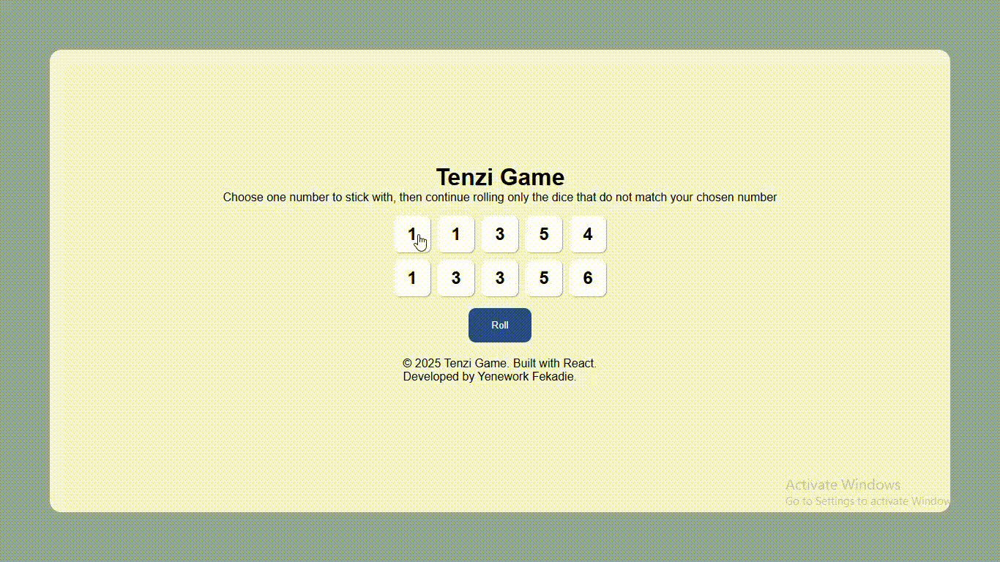
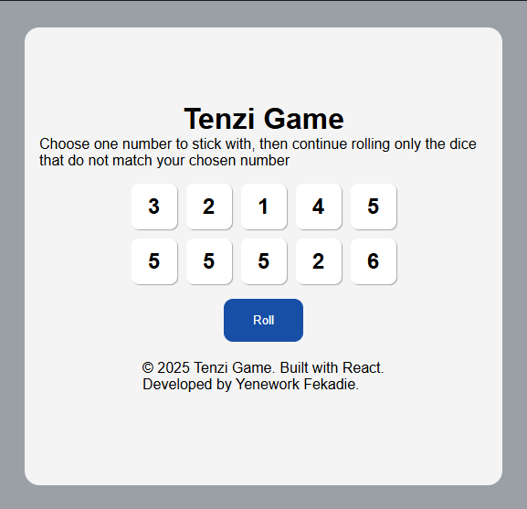
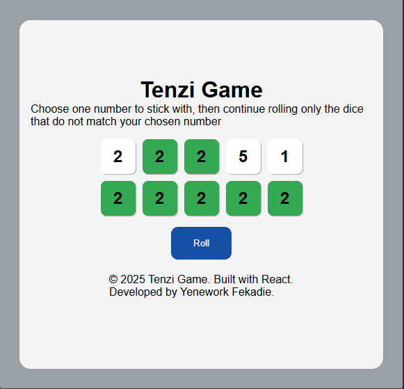
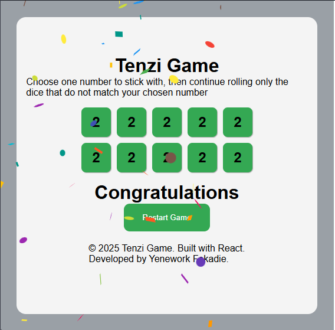

# Tenzi Game
A fun and interactive web-based version of the classic dice game, Tenzi, built with React. The objective is to roll your 10 dice until all of them show the same number.
# ✨ Features
Roll the Dice: Click a button to roll all un-held dice.
Hold and Un-hold: Strategically click individual dice to hold or un-hold them.
Win Detection: The game automatically detects when you have matched all 10 dice and celebrates your victory.
Confetti on Win: A celebratory confetti animation plays upon winning.
Roll Counter and Timer : Tracks the number of rolls and the time taken to complete the game.
Best Score Tracking: Saves and displays your best time and lowest roll count using local storage.
# 💻 Technologies Used
1. React: For building the user interface and managing game state.
2. JavaScript: The core game logic is written in modern JavaScript.
3. CSS: For styling the dice, game board, and animations.
Other libraries: (Example: react-confetti for the confetti effect)
# 🛠️ Installation and Setup
To run this project locally, follow these steps:
Clone the repository:
sh
git clone https://github.com/techgit41/react-tenzi-game.git
Use code with caution.

Navigate to the project directory:
sh
cd https://github.com/techgit41/react-tenzi-game
Use code with caution.

Install dependencies:
sh
npm install
Use code with caution.

Start the development server:
sh
npm start
Use code with caution.

Open in your browser:
The application will open automatically in your web browser at http://localhost:3000.
# 🎮 How to Play
Start the Game: When you first load the application, you'll see a set of 10 dice.
The Objective: Get all 10 dice to show the same number.
Roll: Click the "Roll" button to roll all dice that are not held.
Hold: Click on a die to hold its value. Held dice will not be re-rolled in the next turn.
Repeat: Continue rolling until all 10 dice are the same number.
Win: The game ends when you get Tenzi, and confetti will appear on the screen.
# 🖼️ Preview & Screenshots
1. Game Preview
# 
2. starting game
# 
3. while playing game
# 
4. When winning the game
# 

# 🤝 Contributing
Contributions are always welcome! If you have suggestions for new features, find a bug, or want to improve the code, please feel free to create an issue or submit a pull request.
# 📜 Developer
This game is developed by Yenework Fekadie.
# 👏 Acknowledgments
Inspired by the classic dice game, Tenzi.
